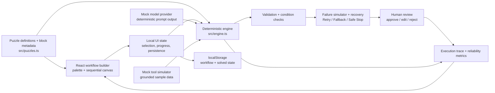

# Puzzleflow — AI Workflow Puzzle Builder

Puzzleflow is a browser-only learning lab for building dependable AI workflows. It uses playful scenarios rather than enterprise diagrams to teach grounded prompting, retrieval, validation, bounded retries, recovery, safe stopping, and human approval.

## Run locally

```bash
npm install
npm run dev
npm test
```

No API key, network service, or paid product is needed. Runs are deterministic: a puzzle plus an unchanged workflow always produces the same trace.

## What you can build

The compact block palette includes core flow pieces—**Input, Retrieval, Condition, Transform, Retry, Output**—and reliability pieces—**AI Prompt, Tool Call, Validator, Fallback, Human Review, Safe Stop**. Every one has a deterministic behavior in the local engine, and all eight starter workflows include Input and Output.

- Eight seeded puzzles across Beginner, Intermediate, and Advanced
- Add, configure, move, delete, and reset sequential blocks
- Stable failure rules based on block ID + kind + config, never editable labels
- Per-step input/output/status/recovery trace and reliability readout
- Browser persistence for selected puzzle, workflows, and solved-puzzle progress
- Keyboard-selectable steps, mobile reorder controls, accessible dialogs, and mock-mode labels

## Architecture



### Module map

- `src/types.ts` — workflow, failure, trace, and report contracts.
- `src/puzzles.ts` — block metadata, stable failure rules, and eight seeded workflows.
- `src/engine.ts` — sequential deterministic execution, retry/fallback/safe-stop semantics, and review completion.
- `src/App.tsx` — responsive builder, configuration, trace, dialogs, and persistence.

## Mock-mode and reliability behavior

**Mock Mode** is explicitly labeled in the app. It never sends a request outside the browser. Prompt, retrieval, tool, transform, condition, validation, and output blocks return deterministic sample results.

Each seeded puzzle contains one repeatable failure. A matching failure must use the seeded block’s stable ID, kind, and exact config. Once a failure occurs, downstream normal blocks are queued until one recovery strategy handles it:

- **Retry** retries the failed operation with a `max: N` configuration. It is explicit, bounded, counted in the reliability metric, and handles one pending failure.
- **Fallback** takes a distinct conservative alternative route, then emits its own retry trace. It also handles one pending failure.
- **Safe Stop** ends the path without inventing a result and receives a strong reliability score.
- **Validator** surfaces groundedness/privacy/format issues instead of silently continuing.
- **Human Review** pauses the workflow. Approve, edit, and reject are explicit decisions; a review can be resumed after its dialog is closed and cannot turn an unresolved failure into success.

## Optional real-provider integration

The app deliberately ships with no real provider wiring. To connect one, keep secrets on a server—not in Vite client variables—and replace the model/tool simulator boundary in `engine.ts` with calls to your own authenticated backend. Return the same structured trace contract, enforce timeouts and schemas server-side, and retain the existing validator, retry cap, safe-stop, and human-review gates. Do not treat the client-side mock safeguards as production authorization controls.

## Assumptions and known limitations

- This is a teaching simulator, not a production workflow runner.
- State is stored per browser in `localStorage`; there is no account, sync, collaboration, or audit backend.
- Retry succeeds deterministically after its bounded attempt; it does not model probabilistic providers or exponential backoff.
- The visual canvas is sequential and uses button-based reordering rather than drag-and-drop.
- Human review is an in-browser decision model and does not notify a real reviewer.

## Test coverage

Focused Vitest tests cover empty-path stopping, failure gating, fallback/retry recovery, explicit Retry configuration, safe stops, review pauses, duplicate fallback behavior, and core block execution.
